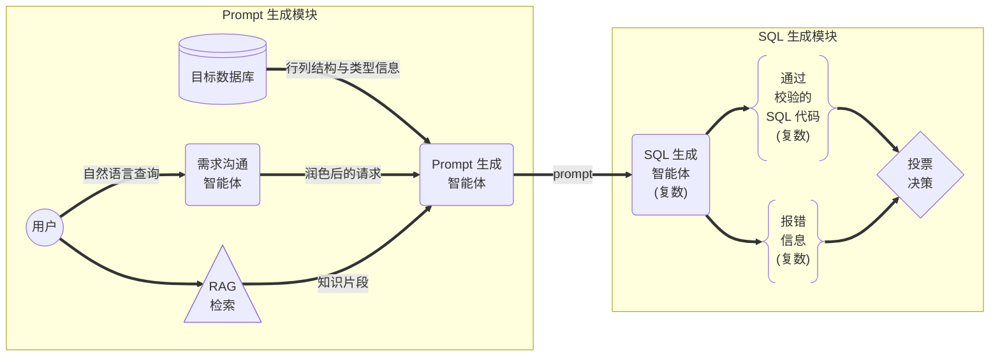
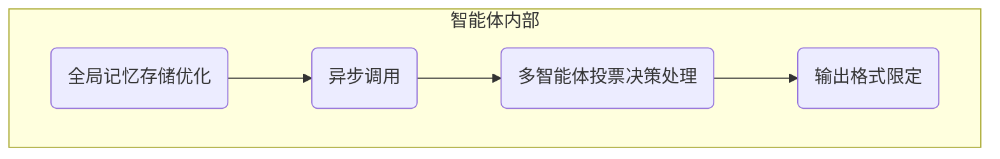

```mermaid
graph LR

subgraph Prompt 生成模块
user((用户)) ==自然语言查询==> AI_commu(需求沟通<br>智能体)
user ==> rag@{ shape: tri, label: "RAG<br>检索" }
db@{ shape: lin-cyl, label: "目标数据库" } ==行列结构与类型信息==> AI_gen_prompt("`Prompt 生成<br>智能体`")
AI_commu ==润色后的请求==> AI_gen_prompt
rag ==知识片段==> AI_gen_prompt
end

subgraph SQL 生成模块
AI_gen_prompt ==prompt==> AI_gen_sql("`SQL 生成<br>智能体<br>(复数)`")
AI_gen_sql ==> sql2@{ shape: braces, label: "通过<br>校验的<br>SQL 代码<br>(复数)" }
AI_gen_sql ==> errs@{ shape: braces, label: "报错<br>信息<br>(复数)" }
sql2 & errs ==> cmp{"投票<br>决策"}
end
```

```mermaid
graph
subgraph "智能体内部"
direction LR
mem(全局记忆存储优化) -->
asio(异步调用) -->
select(多智能体投票决策处理) -->
out(输出格式限定)
end
```
