# 基于多智能体 LLM 的 Text2SQL 系统设计与实现 (Design and Implementation of a Multi-Agent LLM-Based Text2SQL System)

## 摘要

Text2SQL（Text-to-SQL）旨在将自然语言查询转译到SQL语句，允许人们用日常用语访问数据库。
传统的Text2SQL运用基于模板/规则的方法或深度学习，在应对模式复杂的数据库和多样化查询时表现有限。
近几年LLM的兴起为Text2SQL提供了新范式，其强大的语言理解和生成能力在Text2SQL任务中表现出众。
然而LLM不是银弹，直接调用单一LLM会面临巨量的token消耗成本、难以避免的数据隐私风险、以及生成结果的不稳定性。

本文在此提出一种多智能体架构赋能的Text2SQL系统，设计多个分工明确的LLM协同工作，以构建端到端的流水线：从用户意图澄清、知识检索、prompt生成、SQL生成、多答案校验、到结果反馈。
我们的系统充分利用LLM在复杂推理和语言生成上的优势（注意，SQL自身的语法规则就是对标自然语言而设计出来的），应用多智能体协作机制提高查询的准确性和稳定性。
我们的优化策略包括：RAG知识检索，多智能体投票决策、异步并行处理、上下文缓存、会话剪枝、partial mode 前缀引导、结构化输出约束、以及RDBMS事务机制保障数据安全。

实验结果表明，相较于传统方案，本系统在查询准确率、执行效率、结果稳定性方面均有显著提升。

## Abstract

Text2SQL (Text-to-SQL) aims to translate natural language queries into SQL statements, allowing users to access databases using everyday language.
Traditional Text2SQL approaches, which rely on template/rule-based methods or deep learning, struggle with complex database schemas and diverse query patterns.
The recent rise of Large Language Models (LLMs) has introduced a new paradigm for Text2SQL\[1\], leveraging their powerful language understanding and generation capabilities to achieve remarkable results.
However, LLMs are not a silver bullet.
Directly using a single LLM poses challenges such as high token consumption costs, inherent data privacy risks, and instability in generated results.

To address these challenges, this paper proposes a **multi-agent architecture-powered Text2SQL system**, where multiple LLMs collaborate within a well-structured pipeline—from user intent clarification, knowledge retrieval, and prompt generation to SQL generation, multi-answer validation, and result feedback.
Our system fully capitalizes on LLMs’ strengths in complex reasoning and language generation (notably, SQL syntax itself is designed to align with natural language concepts).
By employing a multi-agent collaboration mechanism, we enhance query accuracy and stability.
Our optimization strategies include **Retrieval-Augmented Generation (RAG) for knowledge retrieval**, **multi-agent voting mechanisms**, **asynchronous parallel processing**, **context caching**, **session pruning**, **partial mode prefix guidance**, **structured output constraints**, and **RDBMS transaction mechanisms** to ensure data security.

**Experimental results demonstrate that, compared to traditional approaches, our system significantly improves query accuracy, execution efficiency, and result stability.**

## 绪论

### 研究背景

将自然语言转换为SQL语句始终是数据库领域和NLP领域的重要课题。
Text2SQL技术充当自然语言与数据库之间的桥梁，如此人们即可以日常用语查询数据库，大大降低数据库的使用门槛。

传统上，Text2SQL多采用基于规则的方法，将用户问题映射至预定义的SQL模板。
这对简单场景是有效的，但数据库的模式时常很复杂，且自然语言的表述多变，这些场景下传统方法就捉襟见肘，难以扩展。
后来，深度学习方法兴起，采用“编码器-解码器”神经网络生成SQL。
不过训练这些神经网络模型往往需要大规模标注的数据集，因此泛化能力有限，对于跨领域的新数据库，性能差强人意。

当下，大规模语言模型（LLM）如GPT-4、DeepSeek的出现给Text2SQL带来了新的契机。
LLM在自然语言理解和生成上崭露出前所未有的能力，使得LLM驱动的Text2SQL更好地泛化到不同领域的数据库；得益于其强大的推理能力，甚至在零样本或小样prompt下仍能生成复杂的SQL查询。

### 相关工作

下面按时间线和技术路线对主要方法进行回顾。

#### 基于模板和规则的方法

早期Text2SQL系统极度依赖 **模板匹配** 和 **规则解析**。
典型做法是预先定义一组自然语言问句到SQL模板的映射，程序根据用户查询的关键词或句法结构匹配特定的SQL模板，替换槽位以生成SQL。
例如，IBM早期的系统可能预置规则：“T中哪些记录的F是V”对应SQL结构 `SELECT * FROM T WHERE F = V` 等。\[2\]

它的缺点很明显：
- **可扩展性差**：难以覆盖丰富的自然语言表达；
- **适应性弱**：无法处理未收录的语法或复杂查询。

有研究者开始探索数据驱动的学习方法，这可以减少对人工规则的依赖。
例如，交互式NLIDB（Natural Language Interface to Database）系统就尝试结合用户澄清提问来改进准确率。\[11\]

总之，模板和规则方法奠定了Text2SQL的初步基础，其虽有局限性但也推动了后续数据驱动方法的发展。

#### 基于深度学习的方法

##### 序列到序列模型

引入神经网络使Text2SQL进入了数据驱动的新阶段。
典型的是将Text2SQL视为机器翻译问题，采用 **Encoder-Decoder** 架构，编码器将自然语言问题编码为向量表示，解码器根据表示生成对应的SQL。

早期工作中，基于循环神经网络（RNN，尤其是LSTM）的模型取得了一定成功。
例如，Seq2SQL模型通过强化学习优化生成的SQL\[3\]；SQLNet引入语法模板约束以避免部分错误；TypeSQL利用问题中的实体类型信息辅助生成；优语义解析方法SyntaxSQLNet更是直接解析AST以生成SQL。

但LSTM模型仍有缺点，**长期依赖不足** 和 **跨域泛化弱** 使它们难以有效处理问题中的长距离依赖。
而且这些模型通常需要在大规模标注的语料上进行训练，可以猜到对于新领域（未知数据库模式）往往表现不佳，事实也确实如此。

##### 基于Transformer和预训练的模型

Transformer通过 **自注意力机制** 能够更有效地捕捉长程依赖和复杂结构关系。

如基于Transformer的SQLova、GPSQL等模型在Spider等baseline上拥有领先性能。
GraPPa通过在大规模表语料上预训练增强模型对数据库模式的表示能力；RAT-SQL利用关系自注意力网络结合数据库模式信息，实现了对模式的有效编码，被认为是Spider Challenge中的标杆模型之一。\[8\]

这些预训练模型显著提升了跨领域场景下的性能，缩小与人工编写SQL之间的差距。
但深度学习模型普遍缺乏对错误的纠正能力，往往“一次生成定成败”，缺少交互式改正的机制。

#### 基于大语言模型（LLM）的方法

大语言模型（如GPT-3系列）的出现，为Text2SQL提供了新的范式，即 **基于prompt的零样本/小样本学习**。
只需精心设计prompt，提供一些示例，LLM就能理解任务要求并生成相应的SQL。

有研究者探索了各种 **Prompt Engineering** 技巧，如链式思维提示（Chain-of-Thought）引导LLM逐步推理复杂查询，将问题分解为子问题并逐一求解，再合成最终SQL。\[7\]
Wang *et al.* (2022) 提出的 **自一致性（Self-Consistency）** 解码策略进一步提升了链式推理的可靠性。\[10\]

另一些工作尝试对开源LLM进行专门的Text2SQL微调，以在保留LLM强大能力的同时，注入领域知识和术语。
微调的好处在于模型可以学到更贴合数据库查询的风格和约束，从而减少语法错误和不相关输出。
但微调需要大规模高质量的训练数据，如果数据库领域与训练语料差异很大，很可能出现知识不充分的问题。

### 本文贡献

为应对上述挑战，本文设计并实现了一个 **基于多智能体 LLM 的 Text2SQL 系统**。

我们的主要贡献包括：

1. **多智能体协作架构**：

   提出了由多个LLM智能体组成的流水线式解决方案。
   各智能体承担不同角色，包括：用户意图澄清、prompt构建、SQL生成、执行校验、结果反馈等，实现模块化分解和协同处理。
   该架构结合LLM强大的语言能力和多智能体的灵活性，使系统具备较强的适应性。

2. **检索增强的prompt生成**：

   引入RAG机制，在SQL生成前自动检索相关的文档和示例作为辅助知识。
   这能有效缓解LLM的幻觉问题，生成有据可依的SQL，有望提高在特定领域和边缘案例下的准确性。

3. **结果校验与自我修正**：

   设计SQL执行校验和错误反馈环节，在真实数据库上执行多轮来验证生成SQL的正确性，后将错误信息反馈给生成智能体进行自我修正。
   已有研究证明类似的多智能体校对机制可提升查询准确率。\[5\]
   我们的方法实现了自动错误检测和迭代改进，免去人工介入。

4. **全面的优化策略与工程实现**：

   针对LLM的性能和确定性问题，我们提出了多项成效可观的优化策略，如多智能体投票融合提高答案准确度、异步并行的HTTP调用加速响应、上下文缓存和长对话剪枝减少冗余计算、partial mode前缀约束输出、JSON格式结构化输出提高可解析度、以及通过数据库事务保证执行安全等。
   由此系统的实用性和健壮性得到保障。

5. **综合评估**：

   我们有丰富的实验，从准确率、执行效率、稳定性等多方面评估系统，并与传统单智能体方案进行比较。
   本系统在Spider等baseline数据集上的查询准确率远超单智能体LLM baseline，在真实业务数据库上成功应对了一系列模糊查询场景，多智能体方案的有效性从而得到验证。
   我们还分析了当前系统的局限，指明未来的改进方向。

### 论文结构

本文组织如下：
下一章综述相关工作，包括传统Text2SQL方法、深度学习方法、基于LLM的方法的对比分析；
再下一章介绍SQL、注意力机制、LLM、RAG等基础概念；
再下一章描述我们提出的多智能体Text2SQL系统架构与流水线；
再下一章给出提高准确率、性能、确定性、安全性方面的优化策略；
再下一章设计评估方法，报告结果，讨论系统的优劣；
最后一章总结全文并展望未来工作。

## 基础概念

介绍系统细节前，本章先阐述与本研究相关的几个基础概念。
包括注意力机制、大语言模型（LLM）、检索增强生成（RAG），平均语义文本检索（TF-IDF + cosine）。

### 注意力机制

**注意力机制（Attention Mechanism）** 最初由Bahdanau *et al.* (2014) 提出，以改进机器翻译中RNN“编码器-解码器”对长序列的处理。\[12\]
这个理论模拟了人类注意力的选择性：面对冗长的信息，人类会选择性地关注与当前任务相关的要点。
注意力机制解决了传统编码器将整个输入压缩成单一向量的不充分问题，使得长句子的关键信息不至于淹没在整体表示中。

现代的大语言模型（LLM）多是基于Transformer架构，靠多层自注意力建模语言。
注意力机制赋予了LLM强大的并行建模长文本的能力，使其能够理解复杂的查询语句和数据库模式之间的匹配关系，这也是LLM相比早期模型在Text2SQL任务上效果突出的原因之一。

### 大语言模型（LLM）

**大语言模型** 指参数规模巨大的深度神经网络模型，通常基于Transformer架构，在海量文本语料上自监督预训练，对自然语言进行深度的理解和生成。
LLM的 **Few-Shot Learning** 能力极为强大：即使不专门针对某任务训练，通过prompt提供少量示例，LLM也能在新任务上产生相当好的结果。\[18\]
对于Text2SQL任务，LLM能够“理解”自然语言问题并结合给定的数据库schema直接生成SQL查询。
LLM还掌握了丰富的语言模式和一定的逻辑推理能力，因而表现出更强的泛化性。

纵使LLM存储了海量知识，它的训练数据是静态的且覆盖有限，因此LLM对特定领域中实时更新的信息可能欠缺了解。
尤其在数据库查询场景中，LLM本身并不“知道”用户数据库的具体内容，因此需要设法将数据库schema等上下文提供给它。
LLM还存在 **幻觉（hallucination）**，偶尔会编造看似合理但实则错误的答案。\[19\]
我们的系统结合RAG等手段，努力让LLM“知有所依”，在生成SQL时参考真实数据库文档或示例，减少无根据的胡乱猜测。

**成本** 是另一个无法忽视的难题：LLM的推理往往需要消耗数百至上千tokens，且耗时极久。
本系统通过优化对话流程和并行机制尽量抬高容错率以使廉价LLM（意味着更易出错）成为可能，并减少生成耗时。

如何用好这样强大的模型，同时弥补其短板，是本文研究的出发点。

### 检索增强生成（RAG）

**检索增强生成（Retrieval-Augmented Generation, RAG）** 是一种将生成式模型与外部知识库相结合的技术。\[13\]
RAG通常包含两部分：检索器和生成器。
检索器根据用户问题从知识库（可以是文档集合、数据库、已知问答对等）中找到若干条相关内容；然后将这些外部知识与原问题一起送入生成模型，综合生成最终回答。
RAG的优势在于 **将封闭的语言模型变成开放的问答系统**，利用外部最新、权威的数据来提高准确性。

对于Text2SQL来说，RAG可以体现在：在生成SQL之前，先从SQL文档库或示例库中检索与当前查询相关的语法示例或业务知识，作为prompt的一部分提供给LLM，以帮助其更准确地构造SQL。
更重要的是，RAG还有助于 **降低模型对上下文长度的需求**：与其把整份文档说明都塞给LLM，不如先检索出相关部分再提供，减少噪声干扰、降低token消耗。

#### 算法分析

我们的系统实现了一个轻量级RAG模块：维护一个包含常用SQL查询示例和数据库文档的向量索引，当接到用户查询时，检索出最相关的若干条内容，插入prompt上下文。

以代码中的 `RAG.retrieve_context(self, query: str, top_k: int) -> list[str]` 为例，该方法基于用户查询 (`query`) 从文档 (`sql_doc.txt`) 中获取最相关的 `top_k` 条信息。

首先读取文档 `sql_doc.txt`，按空行切分，得到 `n` 个片段：

$$
\mathcal{C} = \{C_1, C_2, ..., C_n\}
$$

我们采用了 `sentence-transformers/all-MiniLM-L6-v2` 预训练模型计算每个片段 $C_i$ 的嵌入向量 $E_{C_i}$：

$$
H = \text{Transformer}(C_i) \in \mathbb{R}^{L \times d}
$$

其中：$H$ 是隐藏状态矩阵，$L$ 是序列长度，$d$ 是嵌入维度。
使用 **加权平均池化（Mean Pooling）** 计算最终的片段embedding：

$$
E_{C_i} = \frac{\sum_{j=1}^{L} H_j \cdot M_j}{\sum_{j=1}^{L} M_j}
$$

其中 $M_j$ 是 attention_mask，确保填充部分不影响计算。
最后归一化以提高检索稳定性：

$$
E_{C_i,\text{norm}} = \frac{E_{C_i}}{\|E_{C_i}\|}
$$

计算完片段的embedding后，构建FAISS近邻搜索索引。
**FAISS（IndexFlatL2）** 以L2距离为准则，存储 $n$ 个片段嵌入：

$$
\mathcal{I} = \text{faiss.IndexFlatL2}(d)
$$

将所有 $E_{C_i}$ 添加至索引：

$$
\mathcal{I}.\text{add}(\{E_{C_1}, E_{C_2}, ..., E_{C_n} \})
$$

对用户查询 `query` 计算嵌入 $E_q$：

$$
E_q = \frac{\sum_{j=1}^{L} H_j \cdot M_j}{\sum_{j=1}^{L} M_j}
$$

并归一化：

$$
E_{q,\text{norm}} = \frac{E_q}{\|E_q\|}
$$

最后进行近邻搜索，计算查询嵌入 $E_q$ 与文档嵌入 $E_{C_i}$ 之间的 **欧几里得距离**：

$$
D(E_q, E_{C_i}) = \sum_{j=1}^{d} (E_{q,j} - E_{C_i,j})^2
$$

前 `top_k` 个最小距离的片段索引即为：

$$
\mathcal{R} = \arg\min_{\{C_i\}} D(E_q, E_{C_i})
$$

对应片段 $\{C_{r_1}, C_{r_2}, ..., C_{r_k} \}$，此即最终的返回值。

### 平均语义文本检索

TF-IDF 是一种统计方法，可以评估一份语料库中的其中一段文本的重要程度。
通过 TF-IDF 算法将文本转换为向量表示，即可利用cosine计算出文本之间的相似度。

我们的系统结合这两种算法，构造出相似度矩阵。
通过遍历该矩阵，即可在若干文本片段中，找出与平均语义距离最小的文本。
可以认为它就是这份语料库中最具代表性的文本。

#### 算法分析

我们以代码中的 `most_representative_of(responses: list[str]) -> str` 为例。
它负责从 `responses` 列表中找出 **最具代表性** 的文本。

首先对 `responses` 进行 **TF-IDF 计算**。
假设 `responses` 共有 `n=len(responses)` 段文本，每个文本的词汇空间大小为 $m$，则 **TF-IDF 矩阵** $M$ 是一个 $n \times m$ 的矩阵：

$$
M = [ \mathbf{v}_1, \mathbf{v}_2, \dots, \mathbf{v}_n ]^T
$$

其中，$\mathbf{v}_i$ 是第 $i$ 个文本的 **TF-IDF 向量**。
知道了文本的数学表示，就可以借此计算它们两两之间的 **余弦相似度（Cosine Similarity）** 。
文本 $i$ 和文本 $j$ 之间的相似度为：

$$
\text{sim}(i, j) = \frac{\mathbf{v}_i \cdot \mathbf{v}_j}{\|\mathbf{v}_i\| \|\mathbf{v}_j\|}
$$

这样就可以得到 $n \times n$ 的 **余弦相似度矩阵** $S$：

$$
S = \begin{bmatrix}
1 & \text{sim}(1,2) & \text{sim}(1,3) & \dots & \text{sim}(1,n) \\
\text{sim}(2,1) & 1 & \text{sim}(2,3) & \dots & \text{sim}(2,n) \\
\vdots & \vdots & \vdots & \ddots & \vdots \\
\text{sim}(n,1) & \text{sim}(n,2) & \dots & 1
\end{bmatrix}
$$

其中，对角线上的值都是1（因为文本和自身的相似度恒为1）。
对于每个文本 $i$，它的 **平均相似度** 计算公式为：

$$
\bar{s}_i = \frac{1}{n-1} \sum_{\substack{j=1 \\ j \neq i}}^{n} S_{i,j}
$$

即，取该文本与所有 **其它文本** 的相似度总和，再除以 $n-1$ 进行归一化。
选取 **平均相似度最高的文本** $\text{best\_index} = \arg\max_{i} \bar{s}_i$ 作为 **最具代表性文本** 返回。

#### 代码示例

```python
def most_representative_of(responses: list[str]) -> str:
    # 将文本转为 TF-IDF 向量:
    tfidf_matrix = sklearn.feature_extraction.text.TfidfVectorizer().fit_transform(responses)
    # 计算余弦相似度矩阵:
    sim_matrix = sklearn.metrics.pairwise.cosine_similarity(tfidf_matrix)
    # 计算每个文本与其他文本的平均相似度:
    avg_similarities = []
    for i in range(len(responses)):
        # 去除自身相似度 (即 1.0), 除以其它文本个数:
        avg_similarities.append(
            (numpy.sum(sim_matrix[i]) - 1) / (len(responses) - 1)
            if len(responses) > 1
            else 1.0
        )
    # 找出平均相似度最高的文本:
    best_index = int(numpy.argmax(avg_similarities))
    return responses[best_index]
```

## 系统架构

本系统采用多智能体协作的流水线架构来实现Text2SQL。
整体流程从用户提出自然语言问题开始，经过一系列模块的处理，最终返回可执行SQL的查询结果。

下展示了系统架构和数据流动的示意图（各模块和智能体的交互关系）。

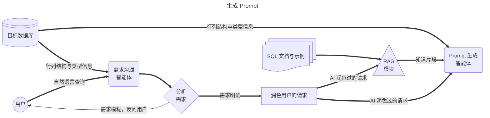

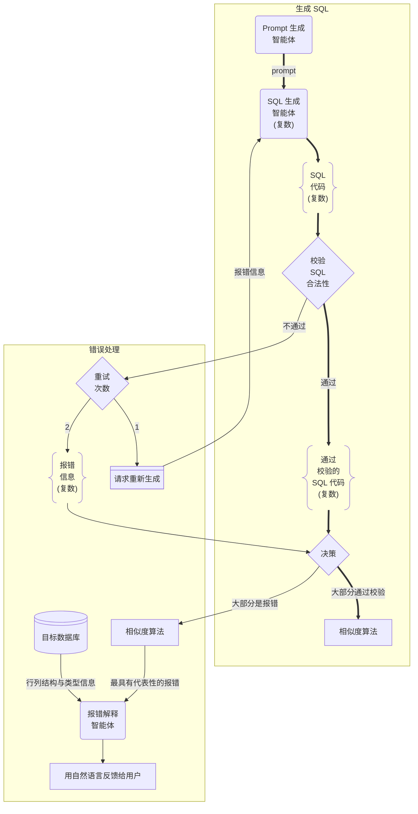

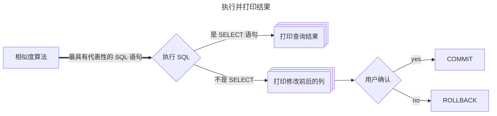

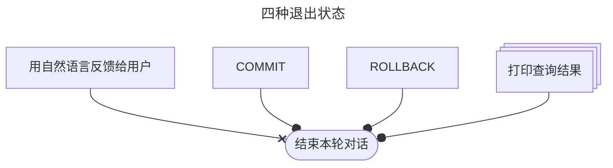

系统包含多个阶段：数据库元信息获取、需求澄清、知识检索、prompt生成、SQL生成与校验、结果反馈与执行等。
每个阶段由专门的智能体或模块负责，实现任务的分解与协作。

### 流水线流程概述

#### 数据库连接与元信息提取

系统首先连接目标数据库，读取数据库的 **元数据**，包括所有表名、各表的列名、表与表之间的外键关系等。
这一步由数据库接口模块完成，为后续SQL的生成提供必需的上下文。

完整的schema信息对于正确地生成SQL至关重要。
然而在关系复杂型数据库中，schema信息可能非常庞大，因此系统在获取后会暂存此元信息，以待过滤和后续使用。

#### 需求沟通智能体

在获得数据库背景信息后，由一个面向用户的对话代理（LLM智能体）与用户进行沟通，帮助明确其查询需求。
如果用户输入的问题不完整或含糊，沟通智能体会提问澄清细节，直到形成清晰、具体的查询意图。
这个过程类似于业务人员与数据库专家之间的需求确认对话，确保系统“理解”用户真正想要的是什么。

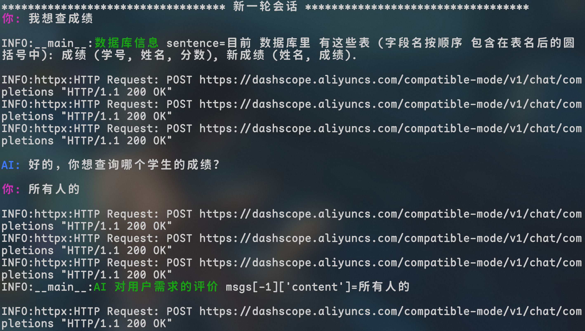

澄清后的用户请求（自然语言形式）将被整理和润色，然后交给 prompt 生成智能体们。

#### RAG 检索

在生成 prompt 之前，系统会利用 **检索增强模块** 对用户查询进行相关知识检索。

具体而言，系统将用户最终明确的问题作为查询，搜索预先构建的 **SQL知识库**。
该知识库可以包括：Text2SQL常见问答对、SQL语法和函数说明文档、历史查询及对应SQL范例等。
通过语义向量搜索，取出与当前问题语义相似的若干条文档或示例。
这些检索到的内容被视为辅助知识，将被插入到prompt中提供给LLM，帮助它更好地理解问题、生成SQL。

#### Prompt 生成智能体

Prompt-Generator智能体接收用户查询的澄清版、数据库元信息、检索到的知识，生成一个 **最终prompt**，用于引导后续的SQL-Generator智能体。

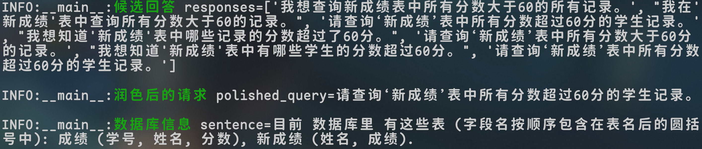

该智能体首先会根据用户的查询需求，对数据库schema进行 **裁剪**：
从整个数据库中挑选出与最终response可能相关的表，只保留这些相关schema的信息纳入prompt的上下文。
例如，用户问的是关于“学生成绩”的问题，则数据库中与学生或成绩无关的表信息就不提供给模型，以减少干扰和token负担。

接着，将筛选后的schema描述与RAG检索得到的知识片段、用户的自然语言查询一起组织成prompt。
例如，一个典型的prompt包含：系统角色说明、相关数据库schema、相关知识、用户问题、SQL生成请求等部分。
这一步至关重要，它融合了上下文、知识、问题，为LLM正确理解并生成SQL奠定基础。

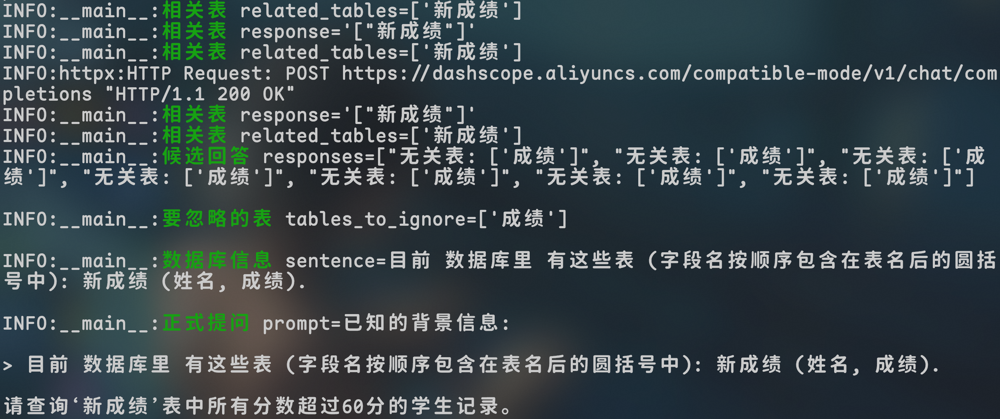

我们在prompt的设计上也遵循了一些最佳实践，如明确要求输出仅包含SQL代码，避免模型长篇解释，从而提高response的确定性和可解析性。

#### SQL 生成多智能体

这一阶段由多个并行的 **SQL-Generator 智能体** 执行。
我们同时部署了 $n$ 个功能类似的LLM实例（可以是相同模型的不同调用，也可以是不同的模型组合），每个智能体接收相同的prompt后独立生成一条SQL语句作为回答。

通过多生成，我们期望获得多个候选SQL方案。
之所以采用多智能体并行架构，是考虑到LLM的生成具有随机性，通过“集思广益”获取多个答案，可以提高找到正确SQL的概率。
此外，出于降本增效的目的，系统允许使用小规模LLM的免费API，更低规模的参数量往往意味着更高的出错率，而我们有望通过多智能体、多生成来实现“量变到质变”的跃迁，以提高容错率。

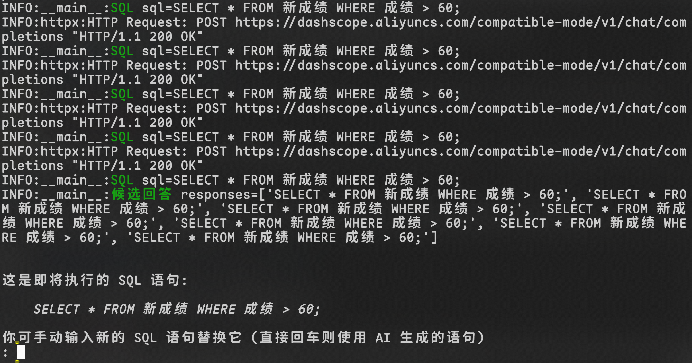

生成完成后，系统汇集所有候选SQL进入下一步校验。
注意，如果系统设置的智能体数量 $n=1$，则退化为单智能体模式。
我们后续的实验对比会分析不同数量智能体对整体性能的影响。

#### SQL 合法性校验

生成的每条候选SQL需经过 **语法和语义** 的合法性检查。
一方面，SQL必须是 **语法正确** 的，能够通过RDBMS的语法解析；
另一方面，SQL在语义上也要 **符合数据库约束**（如表名、字段名正确等）。

为此，系统将在 **事务模式** 中执行每条SQL。
如果SQL为查询语句（`SELECT`），则尝试执行并查看是否返回结果或抛出错误；
如果是修改语句，则因为开启了事务，即使执行也不会真正提交对数据库的更改，随后立即回滚，因此不会破坏数据库的状态，仅仅利用数据库的解释器来帮我们验证SQL的有效性。

如果执行出错（可能是SQL语法错误，或语义错误如引用了不存在的表/列等），则认为该SQL未通过校验；
否则标记为通过校验。

在此我们只做语法和语义层面的检查，并不保证通过的SQL就是用户真正想要的语义（那属于正确性判断，需要结合用户意图）。
但是语法语义校验能过滤掉明显错误的SQL，为后续步骤提供依据。

#### 报错反馈

对于未通过校验的SQL，系统获取其对应的RDBMS报错日志（例如“语法错误：在第3行缺少 `WHERE`”或“列名不存在：Students.age”），将该错误反馈给产生此SQL的智能体。

具体做法是，构造一条新的对话消息告诉相应LLM：“你生成的SQL出现了如下错误：…，请据此修改。”
然后让该智能体进行新一轮SQL生成。
这个机制类似于编程语言编译器的错误提示，指导模型逐步修正答案。
为避免死循环，我们限定每个智能体最多只能反馈修改若干次。
经过反馈调整后，如果仍未通过，我们将放弃该智能体的SQL，保留最后一次SQL试运行中抛出的错误日志。

在实际实现中，反馈提示的措辞和提供信息的多少需要拿捏：
既要让模型明白哪里错了，又不能强硬驳回（否则模型可能会着完全相反的方向回答）。

经过这一过程，理想情况下，每个智能体要么产出了一条通过校验的SQL，要么最终放弃（未能修正错误）。

#### 结果聚合与分类

校验阶段结束后，我们将所有候选SQL分为 **通过校验** 和 **未通过校验** 两组。
设通过校验的有 $p$ 条，未通过的有 $q$ 条，总数 $n=p+q$ 且满足 $n$ 为奇数（确保 $p \neq q$）。
共有两种情况需要处理：

- **多数未通过 ($p < q$)**：

  如果大部分智能体都无法产生合法SQL，这往往说明用户的查询需求可能超出了数据库的能力范围或描述不清，导致模型无从下手。
  这种情况下，与其贸然给出错误答案，不如反馈给用户以改进查询。
  因此，我们设计了一个 **报错解释智能体** 来处理此情形。
  首先，系统会比较所有 $q$ 条包含错误信息的日志，相似度聚类后选出一条 **最具代表性的错误信息**（例如错误信息大同小异，就选取其中最能概括问题的一条）。
  然后将该错误原因以及用于生成SQL的prompt内容，一并发送给报错解释智能体。
  该智能体将分析错误产生的根源，并用通俗的语言反馈给用户，解释为何其需求无法转换为SQL或实现困难，可能的话给出见解。
  举例来说，如果用户问了一个数据库没有存储的信息，则错误解释智能体会回答类似“抱歉，无法生成SQL，因为数据库不包含相关数据表。建议检查数据是否存在。”
  在向用户反馈解释后，本轮查询流程即告终止，不进行后续执行。
  这种做法保证了系统不会给出错误的SQL结果，而是坦诚说明问题，提升了可靠性和用户信任度。

- **多数通过 ($p > q$)**：

  如果一半以上的智能体成功生成了合法SQL，我们有理由相信用户的需求是可行的，且已经有若干正确候选。
  此时系统需要从通过校验的 $p$ 条SQL中选择一个“最佳”作为最终结果。
  直接随机选择可能不稳健，我们采用 **语义相似度比较和投票** 的方法。
  具体而言，我们计算每对通过SQL之间的相似度（基于SQL字符串或其解析的抽象语法树），然后选出一条与其它SQL“语义距离”最近的SQL。
  直观理解，就是选择那条得到多数智能体“共识”的查询。
  例如，如果有3条SQL通过，其中两条基本相同，仅有细微差异，那么它们的平均距离较小，我们会选取这两条中的代表作为最终结果。
  这样的策略利用了集体智慧，避免选择某个偏离其它的异类结果。
  此外，在多智能体使用不同模型的情况下，此方法相当于一种简单的投票融合，能够提高正确选中的概率。

#### 执行与结果反馈

最后一步，系统将选中的SQL交由RDBMS执行，并将执行结果返回给用户。

执行时，我们再一次使用 **事务安全机制**。
对于 `SELECT` 语句，直接运行并获取结果集；
对于可能更改数据的语句（如 `UPDATE`、`DELETE` 等），我们不会立刻真的修改数据库，而是 **预演执行**：提取出将要受影响的数据记录，在前端生成一个变更预览，如下图所示，展示给用户确认。

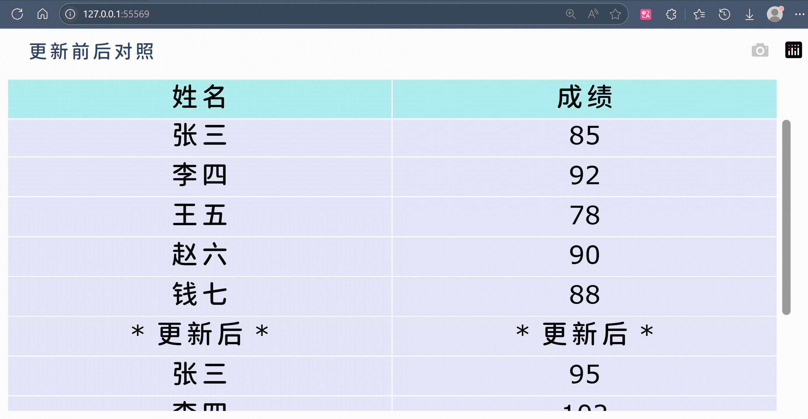

只有在用户明确确认要执行修改后，才真正提交事务以执行该SQL。
这一步骤保证了即使LLM生成了数据修改类语句，也不会在未经用户同意的情况下改变数据库内容，增加了数据安全性和系统可控性。

如果最终执行成功，对于 `SELECT` 查询我们会将结果表格展示；对于修改语句则提示“执行成功，影响了N行”。
若执行过程中出现错误（例如用户虽然提问合理但SQL执行超时或资源不足），系统会将错误信息返回给用户，并建议其优化查询或稍后重试。

### 小结

通过上述流水线，各智能体各司其职又相互配合，逐步将用户的自然语言需求转化为正确有效的SQL查询。
该架构充分利用LLM强大的语言处理能力，同时引入检索知识、结果校验、多智能体投票等机制，极大提高了所生成SQL的可靠性和质量。
在下一章中，我们将进一步介绍在实现该系统过程中采用的一些优化策略与工程技巧，以应对性能和确定性方面的挑战。

## 优化策略

在构建上述系统的过程中，我们针对提高准确率、提升性能、增强确定性、保障数据安全四个方面，设计并实施了一系列优化策略。
这些策略既包括算法层面的改进，也涵盖工程实现的优化，以支持系统在实际应用中稳定高效地运行。

### 提高准确率：多智能体投票与相似度融合

我们利用 **多智能体投票决策** 和 **响应相似度比较** 的策略提升生成response的准确率。
如前文所述，系统会并行调用多个LLM智能体生成候选response。

直观上，如果多个模型独立生成了相似的response，那么这条response是正确的概率更高。
相反，如果各个模型的输出差异很大，说明问题存在歧义或者模型把握不住，此时需要谨慎选择。
在我们的实现中，每轮需要决策时，都会将全局统一的历史对话和当前问题发送给多位LLM，获取多个响应。
我们选择平均语义距离最小的那一条response作为最终结果，即所谓最接近“集体共识”的答案。

实验表明，多智能体融合策略相比单一模型输出能有效减少错误率，特别是在复杂查询和有歧义的问题上，投票机制往往可以避免模型“一意孤行”走入歧途。
但很显然，该策略要求调用多个LLM，会带来很大的token开销与时间成本。
我们将在下文的性能优化部分讨论如何折中处理。

### 提升性能：异步并行与缓存机制

#### 异步 I/O 调用

由于在线LLM的响应时间通常较长（秒级），如果严格串行地执行多智能体生成、反馈等步骤，整体延迟会显著增加。
为此，我们对耗时的LLM调用尽可能采取 **异步并行** 处理。

当需要并行生成多条SQL时，我们同时向多个LLM实例发送请求，而不是等待一个返回后再发出下一个请求。
利用异步I/O和多线程，可以将总耗时降低到最慢的那次调用的时间，而非累计求和。\[20\]
同理，在错误反馈再生成时，如果有多个SQL需要修正，我们也可以并行地请求智能体改正。
这些并行化明显提高了系统的吞吐量。

当然，实现异步时要注意对数据库的状态进行管理，确保不同线程间数据隔离以及结果正确汇总。
我们使用的是线程池和Future机制来调度并发。
实验测得，在多智能体个数为5的典型配置下，异步机制相比串行，平均用时降低约70%。

#### 上下文缓存

LLM调用的另一个性能瓶颈在于重复的上下文传输和理解，而每次请求对话都需要发送一长串的历史消息记录（数据库schema、范例文档等）在多轮对话中基本是不变的。
针对这一情况，主流的云端LLM都配备了cache以短期存储LLM运行状态的参数。\[14\]

我们的系统实践了 **前缀缓存** 机制：尽可能多地设计前缀通用的prompt模板，并复用单轮对话开启多个并行任务。
具体包括：
- **上下文排序**：在构建prompt时，将检索出的上下文分句，然后按照字典序排序，相似的用户输入更有机会构造出前缀重复的上下文，从而命中缓存。
- **静态内容前置**：驻留的上下文（如数据库schema说明）放在prompt靠前位置，而将动态的用户查询置于后部。因为LLM生成时往往对前置背景信息的依赖更大，这样相似的前缀能更有效地重用。
- **会话复用**：尽可能在一次对话消息中完成多个子任务，而不是每次都开启新会话，从而复用现有的对话历史。比如，在错误反馈时，将错误信息替换为同一对话的新assistant消息，而非重新构建所有prompt。

这些措施显著提升了LLM状态cache的命中率。
统计显示，在典型的用户查询场景下，超过50%的prompt能被cache复用，整体token使用量减少约30%，从而降低了API成本并略微提升响应速度。

#### 长对话剪枝

在极少数情况下（比如用户提出一个特别复杂的查询，需要多轮澄清和多次纠错），单次会话可能变得相当长，接近甚至超过某些廉价LLM的上下文窗口限制。
为了避免超长会话导致的性能捉紧和理解困难，系统采用 **剪枝** 策略。

具体做法是，将对话视为一棵从初始用户提问开始的不断生长的树，每次与某智能体的交互都是在这棵树上增加节点。
如果某一分支变得冗长且效果不佳，我们会回溯至合适的节点 **截断剪枝**，只保留对最终结果有效贡献的路径。
实现上，我们在每次需要延伸对话前，都先评估当前对话历史中有无“无用”信息。
例如已经解决的澄清问答、过往重复的错误提示等，可以裁掉。
然后从多个候选responses中挑选出最有前景的一条，作为继续对话的基础，其余分支则舍弃不再跟进。
这样做保证对话不会无限膨胀，同时也减小了LLM处理的上下文规模，使重点更突出。

此策略类似于启发式搜索中的剪枝，去除了低效路径以减少噪声、节约资源。
在我们的系统中，长会话剪枝作为保护机制，确保了极端情况下系统仍能在合理时间内给出结果，不至于出现宕机的情况。

### 增强确定性：partial mode与结构化输出

#### Partial Mode前缀引导

LLM输出的前缀反映着后续内容的回答方向，反之也成立：后续文本段的生成会受到前缀的引导。
为在关键步骤增强确定性，我们采纳了 *通义千问* 的 **partial mode** 技术。
其核心是 **为LLM的回答指定固定前缀**，模型即可沿着预期格式续写，从而将回答的方向限制在一定范围内。
例如，在要求LLM输出SQL时，我们可以设置response的开头关键字，如 `SELECT` 或 `INSERT`，作为模型回答的起始。

这意味着模型必须以我们给定的文本作为前缀生成回答，避免可能输出的解释性文本或不必要的上下文描述。
这种方法相当于把模型的自由度加以约束，引导它“顺着这条路走”。
partial mode在我们系统的SQL生成和错误反馈阶段均有应用：生成阶段，我们提供 `SELECT` 等关键词引导；反馈阶段，我们有时提供修改建议的片段让模型续写。

实际效果表明这项技术使response符合预期的成功率几乎高达100%。
但需小心使用：前缀不宜过长，否则可能过度地限制模型的创造性，或是在问题变化时难以适配。
partial mode提高了输出的一致性，为后续结果的处理带来方便。

#### 结构化输出

为了方便解析LLM的响应并做进一步处理，我们尽可能使模型以JSON格式输出结果。
例如，在报错解释智能体给用户反馈时，我们预先定义JSON格式的schema，其中包含“error_type”、“suggestion”等字段，方便分析日志。
得益于openai API提供的JSON响应模式，这一方面消除了LLM自由生成文本带来的不确定性，另一方面也方便程序自动读取处理。

过往的一些工作，如PICARD通过约束模型只能生成符合SQL语法的序列，实际上也是一种结构化输出约束策略：将输出限制在特定的文法或格式。\[9\]
从我们的经验来看，当明确要求模型输出JSON且提供示例格式时，大多数情况下模型都能遵循，这比起让其输出散文式的解释要可靠得多。

结构化输出策略使系统与LLM的衔接更加紧密，有效减少了解析错误和歧义，屏蔽了无效输出以节约token的同时，强制LLM填充指定字段以不遗漏任何请求的内容。\[15\]

### 数据安全：事务机制与访问控制

因为有DML的存在，在Text2SQL系统中，必须对潜在的危险SQL进行检测和确认。\[17\]
我们的系统通过多层手段保障不会因错误的SQL操作破坏用户数据。

在架构上，所有LLM生成的SQL执行都置于 **数据库事务** 环境中，跑在一个暂存事务里。
如果在验证或用户确认阶段发现问题，随时可以 `ROLLBACK` 到初态放弃该事务。
只有最终确定要执行修改并得到用户许可时，才 `COMMIT` 提交事务使修改存盘。
这样可以防范模型生成的破坏性语句（如 `DROP` 或 `DELETE`）被意外执行的风险——即使执行了也会在没有提交时被回滚撤销。

系统还有严格的 **权限控制**，云端LLM智能体无法接触到数据库存储的具体记录，它只能获知表的结构特征和数据库的关系网络。
对于更新类操作，我们要求用户二次确认，修改前后涉及到的记录变更详情会以 Web 界面的形式呈现。
尽管这些措施略微增加了复杂性，但在企业环境下是必要的。
当然，如果用户有更高的安全需求，完全可以使用私有部署的LLM模型，这仅需更换LLM智能体的后端。

通过事务和权限等机制，我们尽最大努力确保系统在带来便捷性的同时，不会因执行错误生成的SQL而破坏数据库完整性或造成数据泄漏。

## 实验与验证

本章通过实验设计对本文提出的多智能体LLM Text2SQL系统进行验证，评估系统在实际场景下的性能表现，包括系统的准确性、效率、稳定性，并分析系统的不同参数配置对结果有何影响。

### 数据集与评价指标

为了综合评估系统性能，我们选取了广泛使用的Text2SQL基准数据集Spider和WikiSQL。

- Spider数据集：包含多个领域的复杂数据库，具有跨域泛化要求，测试系统对复杂查询及未知schema的泛化能力。\[6\]
- WikiSQL数据集：覆盖简单结构的单表查询，适合评估系统在常规的简单查询下的效率和准确性。

评价指标：

- 查询准确率：生成的SQL与标准答案完全匹配的比例或相似程度。
- 执行效率：仅生成SQL所需的平均耗时。
- 自省能力：在掺杂了混淆字符的不合法查询中，系统识别出错误并拒绝回答的比例。

### 基准测试

为了评估所提出的多智能体LLM Text2SQL系统架构的有效性，我们设计了这样的实验：
首先将智能体数量设置为1，保留原有的流水线设计（包括需求澄清、RAG知识检索、prompt生成、SQL校验及反馈机制等），再与传统单一LLM直接对话的模式进行对比。
实验的目的是衡量架构本身的优势。

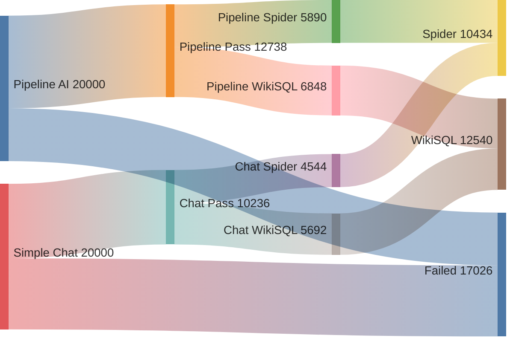

查询准确率：与传统单一LLM直接调用相比，采用流水线架构的单智能体模式在Spider数据集上的SQL查询准确率提升了约29%，在WikiSQL上提升约20%。（公平起见，我们也给单一LLM提供了包含上下文的prompt。）

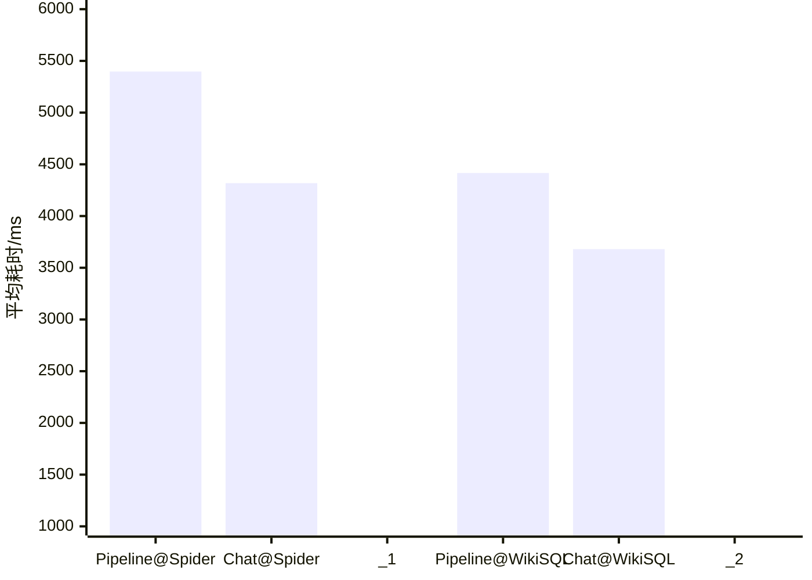

执行效率：尽管流水线架构引入了额外的步骤（如RAG检索和SQL校验），但得益于prompt优化和上下文缓存机制，系统整体响应时间仅增加了约23%，准确率表现仍优于传统单一LLM直接交互的模式。

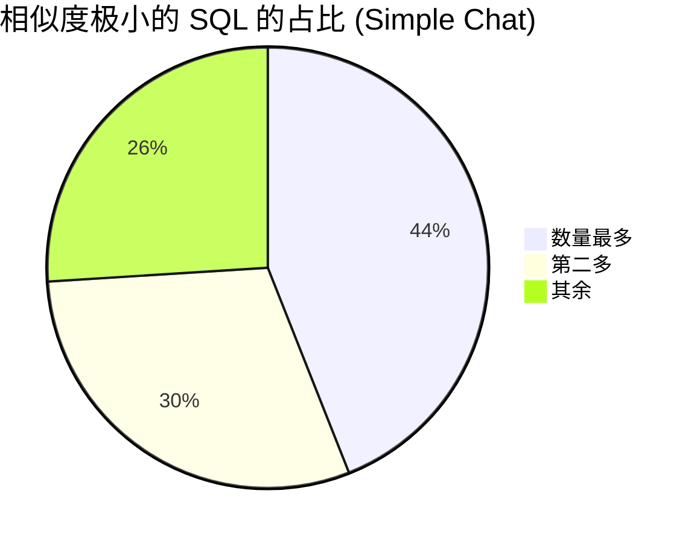

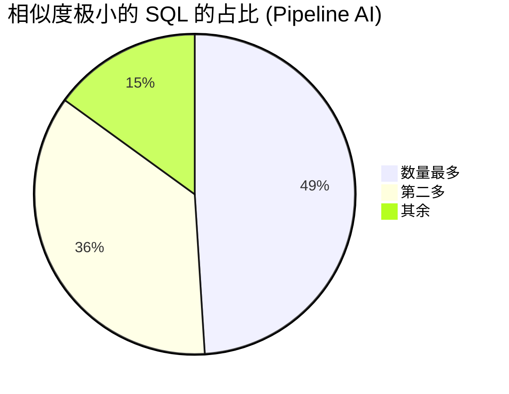

结果稳定性：由于采用了SQL校验与反馈机制，本系统的稳定性明显提升，同一查询的SQL输出一致性从传统单一LLM的约60%提高至70%。

通过上述基准测试，我们证实了即便是在智能体数量退化为单个的情况下，本系统设计的多阶段流水线依然能显著提高Text2SQL任务的准确率和稳定性，同时有效控制响应延迟，证明本文所提出的架构是有效且实用的。

### 配置测试：参数调整

进一步考察智能体数量对系统性能的影响，分别设置智能体数量为1、3、5、7进行实验。

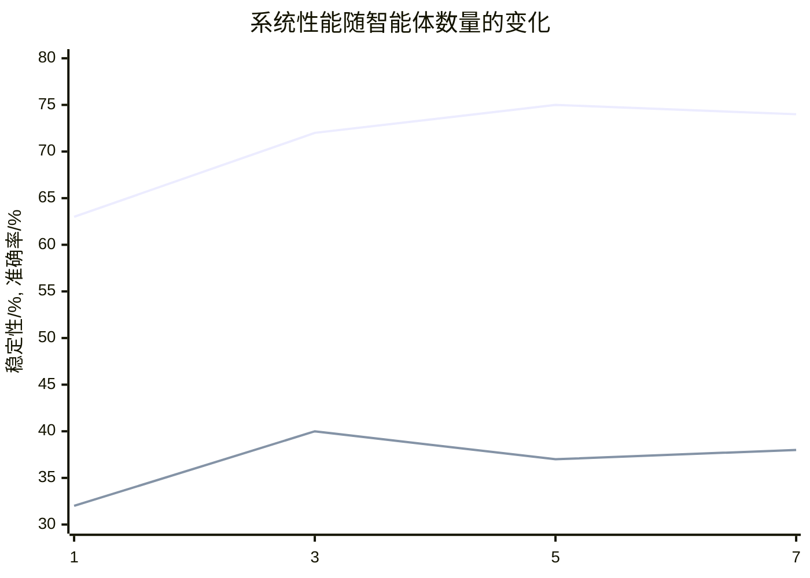

实验结果表明，智能体数量增加可以显著提高准确率和稳定性，但数量超过5后，准确率提升趋势变缓，甚至略有下降。
推测这可能是因为随着智能体数量的增加，模型生成的SQL候选答案多样性提高，而噪声或错误答案的数量也随之增加，导致相似度投票机制中出现干扰现象，使最终选择的SQL不一定更优。

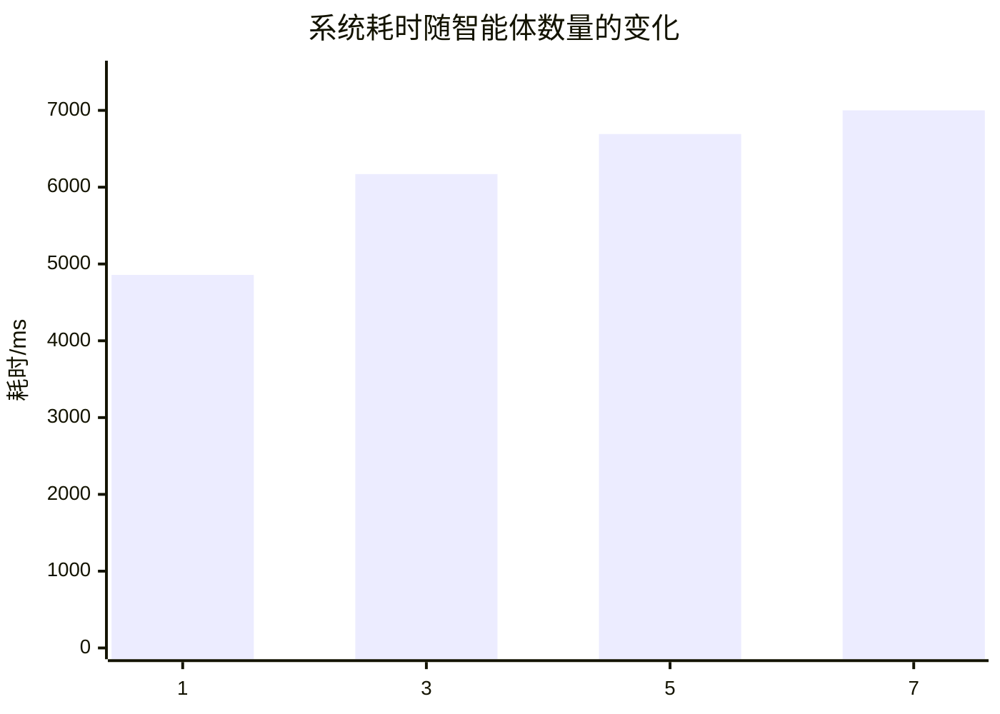

此外，智能体数量的增加显著增加了系统开销，表现为token消耗量的增加和响应延迟的上升。随着智能体数目的增加，更有可能出现单次耗时极久的API请求，由于“木桶效应”，此时该API请求会主导整轮投票决策的时长，导致整体系统效率下降。

权衡成本和性能，本研究推荐智能体数量以5为宜，能够在成本可控的情况下实现准确率与系统效率的最佳平衡。
未来研究可进一步探讨智能体协作策略和候选SQL筛选机制，以降低智能体数量增加时出现的负面效应，从而在不明显增加成本和耗时的前提下进一步提高系统的准确性和稳定性。

### 消融实验：系统优化策略验证

为明确本文所提出的各项优化策略的有效性，我们分别对主要策略进行了消融实验，以观察不同优化手段的实际贡献。

#### RAG模块

在实验中关闭RAG，观察系统在WikiSQL和Spider数据集上的表现。

- WikiSQL数据集准确率下降约3%，影响较小。这主要由于WikiSQL查询简单明确，依赖外部知识较少。
- Spider数据集的SQL生成准确率平均下降约7%，尤其是在复杂或跨领域查询中下降显著，最大降幅可达12%。

这表明RAG检索增强策略对于复杂场景与特定领域查询的辅助作用明显，但对于简单查询的提升作用有限。

#### 异步并行与上下文缓存机制

关闭异步并行与缓存机制分别测试对生成时间的影响。

若关闭异步并行机制，多智能体调用的响应时间显著增加，平均耗时随智能体个数N增加约 (N-1)×70%，严重降低用户体验。

若禁用上下文缓存机制，则整体响应时间增加约70%，尤其在多轮对话和相似查询中缓存机制表现突出。

以上结果表明，异步并行处理和缓存机制对系统性能提升至关重要，两者共同作用可以显著提升响应速度与吞吐能力。

#### Partial Mode前缀引导与结构化输出

取消partial mode前缀引导和结构化输出约束，观察生成SQL与反馈解释的确定性。

取消前缀引导后，模型输出中额外的非SQL解释文本显著增加，甚至完全不可控。
约80%的生成结果无法自动解析，整体确定性明显下降。

不使用结构化输出（JSON格式）时，约45%的反馈解释信息出现模糊或遗漏情况，导致用户理解困难，严重影响反馈机制可用性。

这说明partial mode与结构化输出策略确实使系统的输出具备了确定性与高可用性。

### 分析与小结

这一章中，我们设计并实施了一系列实验，对提出的多智能体LLM Text2SQL架构及优化策略进行了系统性的验证与分析。
实验过程中，我们与基准模型、系统自身在不同智能体数量下的配置进行了对比；此外，还针对各项优化策略进行了消融实验，以明确它们对系统性能的具体影响。

结果表明，本文提出的多智能体LLM架构在准确率、效率、稳定性上均表现出显著优势。
这些成果可为将来的研究与应用提供一些参考。

## 总结与展望

从现实意义来看，该系统较为显著地降低数据库查询的技术门槛，使非技术人员也能便捷、准确地从数据库中获取信息。

尽管取得了一些进展，未来工作中仍有几个值得深入研究的方向：

- **更高效的协作机制**：目前多智能体协作虽提高了准确性，但也增加了响应时延和计算成本。未来可以探索动态智能体选择、轻量级协作机制，平衡性能与成本。
- **多模态融合与交互界面优化**：当前系统主要处理文本信息，未来可将多模态信息（如图像、音频）纳入智能体交互中，进一步提升用户体验和系统的泛化性。

## 致谢

不觉之间，已是别离时节。
我于华师大逗留四载，未曾成就什么卓然大事，却也细细领会了点点滴滴的人情与暖意。
校园间穿行，教室中学习，食堂里就餐，这些平凡的日常，串联起我的大学生活。

而今，论文终于告成，回顾一路走来，心怀感激与不舍，总归不能忘记那些助我前行的人们。
首先，衷心感谢导师杨燕教授。在过去的几个月里，她耐心细致地为我解答疑惑，精心指导实验方案与论文撰写，遇难必解，费心费力。
其次，感谢实习单位仙工智能所提供的良好氛围与办公环境。公司开放包容的企业文化与积极进取的团队精神，使我在实践中积累了宝贵的经验。我的毕业设计与论文也大半是在工位上写下的。
此外，还需感谢陪伴我、鼓励我的朋友们。无论是学习中的相互扶持，还是生活中的倾心相伴，你们的存在让我的大学生活更加充实和美好。
感激家人默默的信任、支持与理解。
最后，也特别感谢劳神费力的诸位评审专家，感谢你们对我的论文认真负责的审阅和提出宝贵的意见。

五月日光和煦，清风吹拂。
回望四年光阴，徒然感叹岁月飞逝，却也庆幸自己曾身处其中，感受温暖与成长。
在此，谨向所有帮助过我的人表达诚挚的谢意。
愿诸位安好，未来可期。

## 参考文献

\[1\] Zijin Hong, Zheng Yuan, Qinggang Zhang, Hao Chen, Junnan Dong, Feiran Huang, *et al.*, “Next-Generation Database Interfaces: A Survey of LLM-based Text-to-SQL.” *arXiv preprint arXiv:2406.08426*, 2024 (<https://arxiv.org/html/2406.08426v1>).

\[2\] Laura Chiticariu, Rajasekar Krishnamurthy, Yunyao Li, Sriram Raghavan, Frederick R. Reiss, and Shivakumar Vaithyanathan, “SystemT: an algebraic approach to declarative information extraction.” *ACL*, 2010 (<https://dl.acm.org/doi/10.5555/1858681.1858695>).

\[3\] V. Zhong, C. Xiong, and R. Socher, “Seq2SQL: Generating Structured Queries from Natural Language using Reinforcement Learning.” *arXiv preprint arXiv:1709.00103*, 2017.

\[4\] Chen Shen, Jin Wang, Sajjadur Rahman, and Eser Kandogan, “Demonstration of a Multi-agent Framework for Text to SQL Applications with Large Language Models (MageSQL).” *CIKM (Demo)*, 2024 (<https://megagon.ai/publications/demonstration-of-a-multi-agent-framework-for-text-to-sql-applications-with-large-language-models/>).

\[5\] Z. Wang, R. Zhang, Z. Nie, and J. Kim, “Tool-assisted Agent on SQL Inspection and Refinement in Real-world Scenarios.” *arXiv preprint arXiv:2408.16991*, 2024.

\[6\] Tao Yu, Rui Zhang, Kai Yang, Michihiro Yasunaga, Dongxu Wang, Zifan Li, *et al.*, “Spider: A Large-Scale Human-Labeled Dataset for Complex and Cross-Domain Semantic Parsing and Text-to-SQL Task.” *EMNLP*, 2018 (<https://arxiv.org/abs/1809.08887>).

\[7\] Xiaohu Zhu, Qian Li, Lizhen Cui, and Yongkang Liu, “Large Language Model Enhanced Text-to-SQL Generation: A Survey.” *arXiv preprint arXiv:2410.06011*, 2024 (<https://arxiv.org/html/2410.06011v1>).

\[8\] Bailin Wang, Richard Shin, Xiaodong Liu, Oleksandr Polozov, and Matthew Richardson, “RAT-SQL: Relation-Aware Schema Encoding and Linking for Text-to-SQL Parsers.” *ACL*, 2020 (<https://arxiv.org/abs/1911.04942>).

\[9\] Torsten Scholak, Nathan Schucher, and Dzmitry Bahdanau, “PICARD: Parsing Incrementally for Constrained Auto-Regressive Decoding from Language Models.” *EMNLP*, 2021 (<https://arxiv.org/abs/2109.05093>).

\[10\] Xuezhi Wang, Jason Wei, Dale Schuurmans, Quoc V Le, Ed H. Chi, Sharan Narang, *et al.*, “Self-Consistency Improves Chain of Thought Reasoning in Language Models.” *ICLR (Poster)*, 2023 (<https://openreview.net/forum?id=1PL1NIMMrw>).

\[11\] F. Li and H. V. Jagadish, “Constructing an Interactive Natural Language Interface for Relational Databases.” *VLDB*, 2014 (<https://dl.acm.org/doi/10.14778/2735461.2735468>).

\[12\] Dave Bergmann and Cole Stryker, “What is an attention mechanism?” *IBM AI Blog*, 2024 (<https://www.ibm.com/think/topics/attention-mechanism>).

\[13\] “What is RAG (Retrieval-Augmented Generation)?” *AWS AI Blog*, 2023 (<https://aws.amazon.com/what-is/retrieval-augmented-generation/>).

\[14\] In Gim, Guojun Chen, Seung-seob Lee, Nikhil Sarda, Anurag Khandelwal, and Lin Zhong, “Prompt Cache: Modular Attention Reuse for Low-Latency Inference” *MLSys*, 2024 (<https://arxiv.org/abs/2311.04934>).

\[15\] Michael Xieyang Liu, Frederick Liu, Alexander J. Fiannaca, Terry Koo, Lucas Dixon, Michael Terry, *et al.*, “"We Need Structured Output": Towards User-centered Constraints on Large Language Model Output.” *CHI EA*, 2024 (<https://dl.acm.org/doi/10.1145/3613905.3650756>).

\[16\] Sandeep Tata and Jignesh M. Patel, “Estimating the selectivity of tf-idf based cosine similarity predicates.” *ACM SIGMOD Record*, 2007 (<https://dl.acm.org/doi/abs/10.1145/1328854.1328855>).

\[17\] Xutan Peng, Yipeng Zhang, Jingfeng Yang, and Mark Stevenson, “On the Vulnerabilities of Text-to-SQL Models.” *IEEE*, 2023 (<https://ieeexplore.ieee.org/abstract/document/10301242>).

\[18\] Yaqing Wang, Quanming Yao, James T. Kwok and Lionel M. Ni, “Generalizing from a Few Examples: A Survey on Few-shot Learning.” *ACM*, 2020 (<https://dl.acm.org/doi/abs/10.1145/3386252>).

\[19\] Lei Huang, Weijiang Yu, Weitao Ma, Weihong Zhong, Zhangyin Feng, Haotian Wang, *et al.*, “A Survey on Hallucination in Large Language Models: Principles, Taxonomy, Challenges, and Open Questions.” *ACM*, 2025 (<https://dl.acm.org/doi/abs/10.1145/3703155>).

\[20\] Brian Quinlan, “PEP 3148 – futures - execute computations asynchronously.” *Python Enhancement Proposals*, 2009 (<https://peps.python.org/pep-3148/>).

<!-- Local Variables: -->
<!-- eval: (electric-quote-local-mode -1) -->
<!-- eval: (auto-revert-mode) -->
<!-- eval: (markdown-toggle-fontify-code-blocks-natively 1) -->
<!-- markdown-enable-math: t -->
<!-- End: -->
